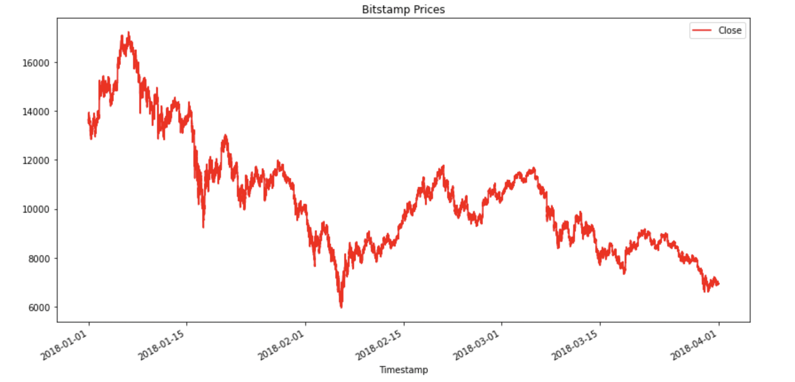
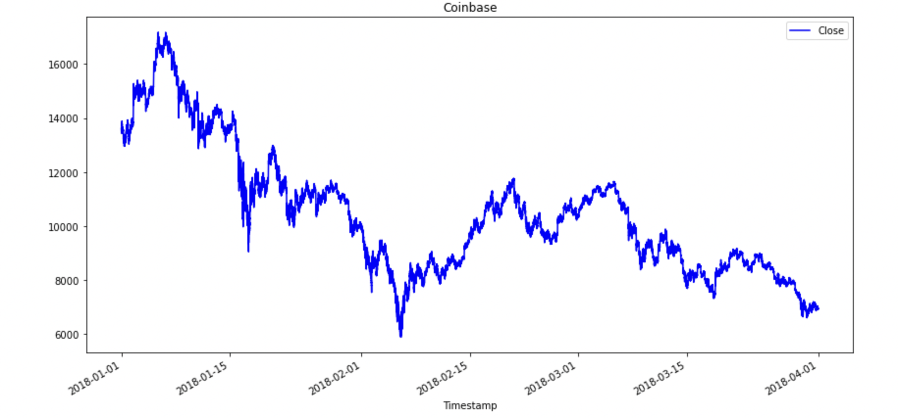
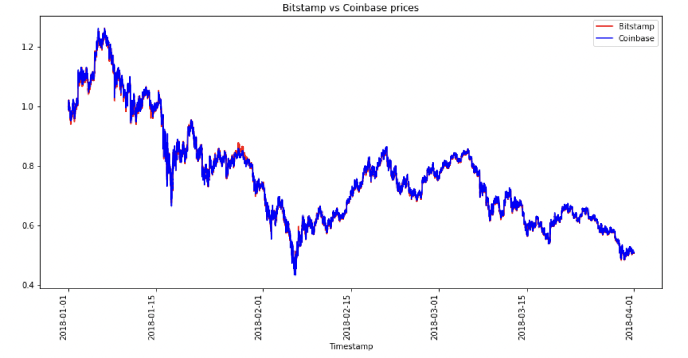

# Module 3 Challenge - Crypto Arbitrage

## Application to sort through historical trade data for Bitcoin on two exchanges: Bitstamp and Coinbase

his is a python command-line interface application that sorts through historical trade data for Bitcoin on two exchanges: Bitstamp and Coinbase. The three phases of financial analysis(data collection, preparation, and analysis) is used to determine if any arbitrage opportunities exist for Bitcoin.

**Usage**

To use this application, simply clone the repository and open jupyter lab from git bash by running the following command:

```
jupyter lab
```
Goto jupyter lab from browser to open [jupyter lab](http://localhost:8888/lab/workspaces/auto-f)

---
## Examples


### Bitstamp graph for all time


### Coinbase graph for all time


### Bitstamp vs Coinbase prices graph for all time

